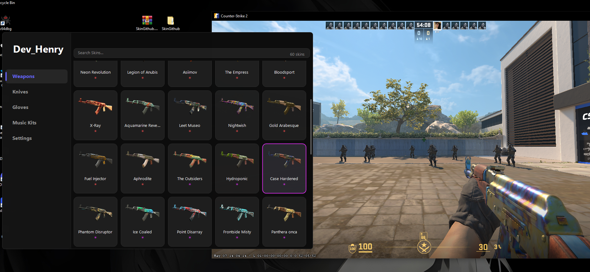

# CS2 Skin Changer - Educational Simplified Version

## Educational Purpose

This project is **simplified and documented** for educational purposes. Complex logic for knives, gloves, and code injection has been removed, keeping only the essentials: **applying skins to weapons**.

The code is **fully documented in Portuguese** with detailed explanations on:
- How Windows memory works
- How Source 2 manages entities and attributes
- How to avoid crashes (Access Violation 0xC0000005)
- Best C++ programming practices

## What This Project Does

Applies custom skins to CS2 weapons **without modifying the game**. Works via:
- `ReadProcessMemory`: reads cs2.exe memory
- `WriteProcessMemory`: writes values to correct offsets
- **No DLL injection**, **no game code modification**

### Maintained Features ✅
- ✅ Weapon skins (AK-47, AWP, M4A4, etc.)
- ✅ Music Kits
- ✅ State validation (prevents crashes)
- ✅ Memory caching (optimization)
- ✅ Graphical interface (ImGui)



### Removed Features ❌
- ❌ Knives (custom models)
- ❌ Gloves
- ❌ Shellcode/code injection
- ❌ AcceptInput (subclass swap)

## Build and Usage

### Prerequisites
- Visual Studio 2022 (or higher) with C++17 support
- Windows 10/11
- CS2 installed and running

### Build Steps
1. Open `ext-cs2-skin-changer.sln` in Visual Studio.
2. Select `Release` configuration and `x64` platform.
3. Click "Build" > "Build Solution".
4. Executable will be generated in `x64/Release/ext-cs2-skin-changer.exe`.

### Usage
1. Run CS2.
2. Run `ext-cs2-skin-changer.exe` as administrator.
3. Select a skin in the menu and apply.
4. Ensure CS2 is in a match to see changes.

**Note:** This project is for educational purposes. Use at your own risk.

## Project Architecture

### File Structure
```
ext-cs2-skin-changer/
├── src/
│   ├── main.cpp                 # Main loop (DOCUMENTED)
│   ├── StateSync.hpp/cpp        # State management (SIMPLIFIED)
│   ├── menu.h                   # GUI (ImGui)
│   ├── config.h                 # Save/load settings
│   └── SDK/
│       ├── CEconItemAttributeManager.h # Custom attributes (DOCUMENTED)
│       └── weapon/
│           └── C_EconEntity.h   # Weapon functions (SIMPLIFIED)
├── ext/
│   ├── mem.h                    # Memory class (DOCUMENTED)
│   ├── offsets.h                # CS2 offsets (a2x dumper)
│   └── skindb.h                 # Skin database
└── README.md                    # This file
```

## Technical Overview

This tool reads and writes to CS2's memory using Windows APIs like `ReadProcessMemory` and `WriteProcessMemory`. It applies skins by modifying weapon attributes without injecting code or altering game files.

For detailed technical explanations, see the code comments.

## Contributing

If you implement knife or glove features, please tag me (@Henrih56) so I can review. Contributions are welcome for educational improvements.

## License

This project is licensed under GPL v3. **It is strictly prohibited to sell or commercialize this project.** Use only for educational and personal purposes.